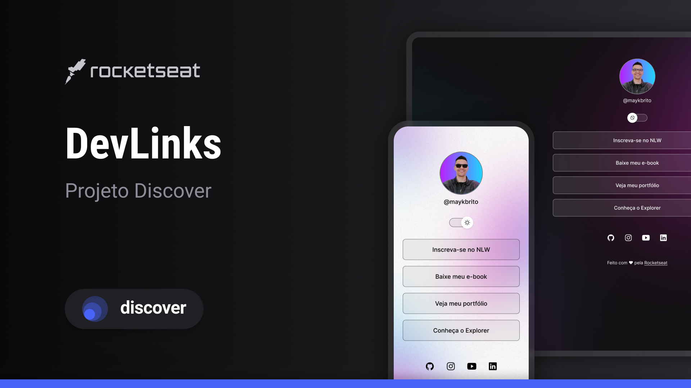

<h1 align="center">git  Devlinks </h1>

 Evento exclusivo e gratuito, promovido pela Rocketseat para ensino de tecnologias WEB.
 
<a
href="https://lp.rocketseat.com.br/devlinks/inscricao?utm_source=github&utm_medium=descricao&utm_campaign=capture-devlinks&utm_term=organic&utm_content=descricao-github-mayk-brito">Estude esse projeto em formato de vídeo clicando aqui.</a>

<a href="#-tecnologias">Tecnologias</a>&nbsp;&nbsp;&nbsp; |&nbsp;&nbsp;&nbsp;
<a href="#-projeto">Projeto</a>&nbsp;&nbsp;&nbsp; |&nbsp;&nbsp;&nbsp;
<a href="#-layout">Layout</a>&nbsp;&nbsp;&nbsp; |&nbsp;&nbsp;&nbsp;
<a href="#memo-licenca">Licença</a>

 

 

## 🚀 Tecnologias

 Esse projeto foi desenvolvido com as seguintes tecnologias: 

<ul>
<li> HTML e CSS </li>
<li> JavaScript</il>
<li> Git e Github</il>
<li> Figma</il>
</ul>

## 💻 Projeto

O DevLinks é um agregador de links para usar como cartão de visitas online.

<ul>
<li><a href="https://maykbrito.github.io/devlinks/">Acesse o projeto finalizado, online</a></il>
<li><a href="https://lp.rocketseat.com.br/devlinks/inscricao?utm_source=github&utm_medium=descricao&utm_campaign=capture-devlinks&utm_term=organic&utm_content=descricao-github-mayk-brito">Assistir aulas</a></il>
</ul>

## 🔖 Layout

 Você pode visualizar o layout do projeto através <a href="https://www.figma.com/community/file/1187422022288947321">DESSE LINK</a>. É necessário ter conta no <a href="https://www.figma.com/">Figma</a> para acessá-lo. 

## 📝 Licença

Esse projeto está sob licença MIT

##

Feito com ♥ by Rocketseat 👋 <a href="https://discord.gg/rocketseat">Participe da nossa comunidade!</a>
